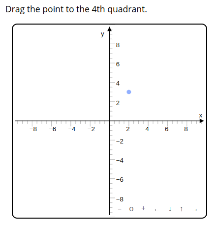

# DoenetML

Monorepo for DoenetML Components. See the `packages/*` folders for individual components.

# What is DoenetML?

Semantic markup for building interactive web activities.
[Read more about Doenet](https://www.doenet.org)

```xml
<p>Drag the point to the 4th quadrant.</p>
<graph>
    <point xs='2 3'/>
</graph>
```



## Features

-   Internally manages a directed acyclic graph of dependencies to coordinate updates of self-referential worksheets

## Quickstart

In the project folder:

`$ npm install`

`$ npm run dev`

Paste demo code into `src/test/testCode.doenet`

Navigate to `localhost:5173`

## Demos

<details>
<summary>Point and Collect</summary>

```xml
<graph name="graph">
	<point name="p1" xs="2 3"/>
	<point name="p2" xs="$p1.y $p1.x"/>
</graph>
<asList>
	<collect source="graph" componentTypes="point"/>
</asList>
```

</details>

<details>
<summary>Text Input</summary>

```xml
<textInput name="t1" prefill="Cake"/>
<text>$t1.value is good.</text>
```

</details>

<details>
<summary>Sequence and Math Input</summary>

```xml
<mathInput name="n1" prefill="4"/>
<mathInput name="n2" prefill="14"/>
<p>
	Count from $n1.value to $n2.value:
	<aslist><sequence name="seq" from="$n1.value" to="$n2.value"/></aslist>.

	And the fifth number is $seq[5].value.
</p>
```

</details>

<details>
<summary>Point Parallelogram</summary>

```xml
<graph>
    <point name="p1" xs="0 4" />
    <point name="p2" xs="3 0" />
    <point name="p3" xs="$p1.x+$p2.x $p1.y+$p2.y" />
</graph>
```

</details>

<details>
<summary>Boolean Input</summary>

```xml
<booleanInput name="bool"/>

I think<text hide="$bool"> therefore I am</text>.

<booleanInput name="bool2"/>
<text hide="$bool2">Yin</text>
<text hide="!$bool2">Yang</text>
```

</details>

<details>
<summary>Value vs Immediate Value</summary>

```xml
<graph name="graph">
	<point name="p1" xs="$n1.value $n2.value"/>
	<point name="p2" xs="$n1.immediateValue+0.5 $n2.immediateValue"/>
</graph>

<mathInput name="n1" prefill="0"/>
<mathInput name="n2" prefill="0"/>

One point uses immediate value plus an offset
```

</details>

<details>
<summary>Collect Component Index</summary>

```xmlThe following paragraph contains numbers and sequences based on the number
<number name="n" copySource="/_mathinput1" />:

<p name="p1">
This paragraphs contains:
number
<number>23</number>
sequence
<aslist><sequence from="1" to="$n"/></aslist>
number
<number>42</number>
number
<number>2</number>
sequence
<aslist><sequence from="$n" to="2*$n"/></aslist>
number
<number>30</number>
</p>

Collect the numbers in that paragraph: <aslist><collect name="c1" source="p1" componentTypes="number"/></aslist>.

The fifth number is $c1[5].value.

Now try changing the number
<mathInput prefill="6"/>
```

</details>

<!-- ## Technical Documentation
JavaScript parses the DoenetML and calls Rust functions, passing in strings. On core creation, Rust returns a pointer to its main struct, existing in WASM linear memory. Javascript uses this to access the other core functions. Rust returns rendering data as strings.

The Doenet Rust code is in the doenet-core crate, doenet-core/src/lib.rs being the main file. The crate can be built as a library independent of javascript, but without a parser, one would need pre-parsed DoenetML objects as its input. -->
